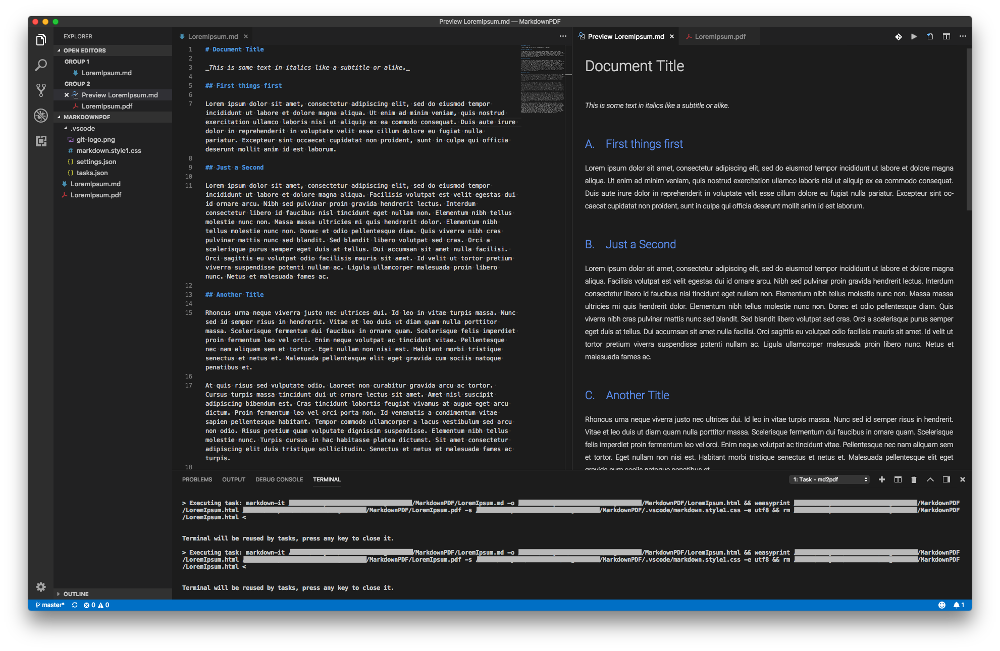

# Markdown PDF

Use .md files as source files to produce simple PDF files. Similar to (La)Tex, this allows to have plain text source files and generate PDF from it. Ingredients:

* [Visual Studio Code](https://code.visualstudio.com) (incl. [vscode-pdf plugin](https://marketplace.visualstudio.com/items?itemName=tomoki1207.pdf) and perhaps [mermaid-plugin](https://marketplace.visualstudio.com/items?itemName=bierner.markdown-mermaid) if you use mermaid)
* `remark and its plugins`:

    ```shell
    npm install -g remark remark-cli remark-html remark-highlight.js remark-toc mermaid.cli remark-mermaid
    ```

  Delete from the command / omit if you don't need:

  * `highligh.js` Code Syntax Highlighting
  * `toc` Table of Contents (very little configuration possibilities)
  * `mermaid` "Write graphs" in markdown.

* [weasyprint](https://weasyprint.org) to convert .html to .pdf; _When installing python on windows **make sure** to install [python 64bit version](https://www.python.org/downloads/windows/) if you have a 64bit machine_

Size on disk: ~350MB - 550MB (see Installation Size). As compared to 1.5GB of Latex (with Editor). Use this project as a template.

## Result

Visual Studio Code: Live Markdown Preview:  


Visual Studio Code: PDF Preview (using [vscode-pdf plugin](https://marketplace.visualstudio.com/items?itemName=tomoki1207.pdf)):  


## Installation Size

| Software | Size |
|-|-|
| Visual Studio Code | 220MB |
| vscode-pdf plugin | 3MB |
| Node/npm (markdown-it) | 40MB (~100kb) |
| weasyprint | ~100MB - 250MB (incl. python3 and GTK3+; larger on Windows) |

## Issues / Limitations

* Check out `windows-specific` branch when using powershell (on Windows)
* When using a font family on `pre`-tag weasprint/pango fails to handle empty lines. As a workaround we only use a single font for `pre`-tags. Adjust the `css` according to your font available. (see [#415](https://github.com/Kozea/WeasyPrint/issues/415https://github.com/Kozea/WeasyPrint/issues/415))
* Not all SVG's are printed correctly (`'NoneType' object has no attribute 'get'`).

* weasyprint does not support MathML, but packages like [MathJAX](https://github.com/mathjax) would be able to convert Tex, AsciiMath, and MathML to SVG - unfortunately not `remark` plugin on that end.