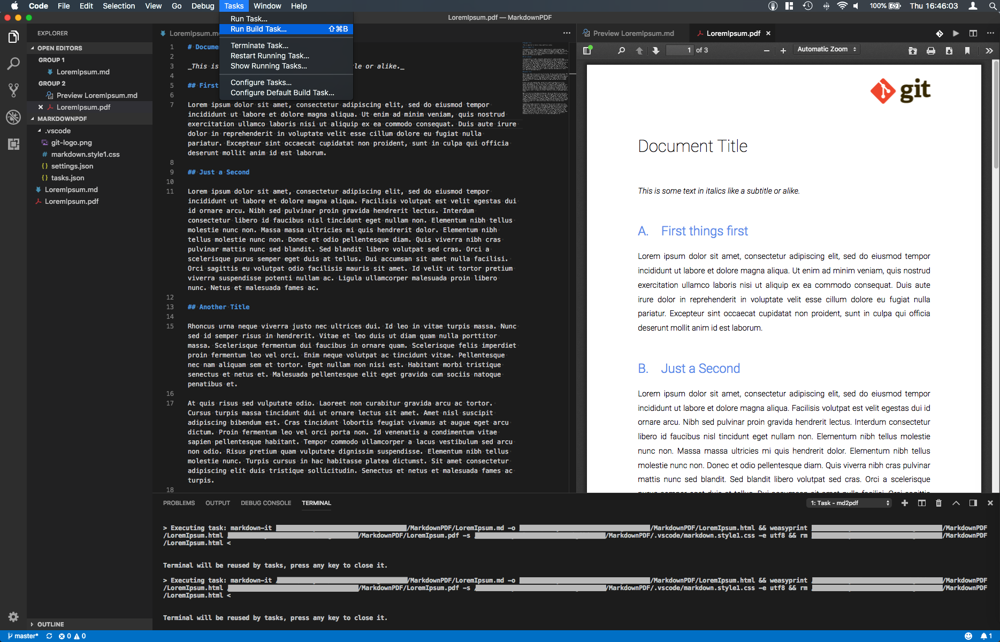

# Markdown PDF

Use .md files as source files to produce simple PDF files. Similar to (La)Tex, this allows to have plain text source files and generate PDF from it. Ingredients:

* [Visual Studio Code](https://code.visualstudio.com) (incl. [vscode-pdf plugin](https://marketplace.visualstudio.com/items?itemName=tomoki1207.pdf))
* [markdown-it](https://github.com/markdown-it/markdown-it) to convert .md to .html. _Install it using `npm install -g markdown-it` once you have [Node(npm)](https://www.npmjs.com/get-npm) installed. This makes `markdown-it` available as a command in your shell._
* [weasyprint](https://weasyprint.org) to convert .html to .pdf; _When installing python on windows **make sure** to install [python 64bit version](https://www.python.org/downloads/windows/) if you have a 64bit machine_

Size on disk: ~350MB - 550MB (see Installation Size). As compared to 1.5GB of Latex (with Editor). Use this project as a template.

## Result

Visual Studio Code: Live Markdown Preview:  

Visual Studio Code: PDF Preview (using [vscode-pdf plugin](https://marketplace.visualstudio.com/items?itemName=tomoki1207.pdf)):  

## Installation Size

| Software | Size |
|-|-|
| Visual Studio Code | 220MB |
| vscode-pdf plugin | 3MB |
| Node/npm (markdown-it) | 40MB (~100kb) |
| weasyprint | ~100MB - 250MB (incl. python3 and GTK3+; larger on Windows) |

## Issues / Limitations

* Check out `windows-specific` branch when using powershell (on Windows)
* Code blocks / syntax highlighting: I didn't figure out yet how to do it. Perhaps it's not possible.